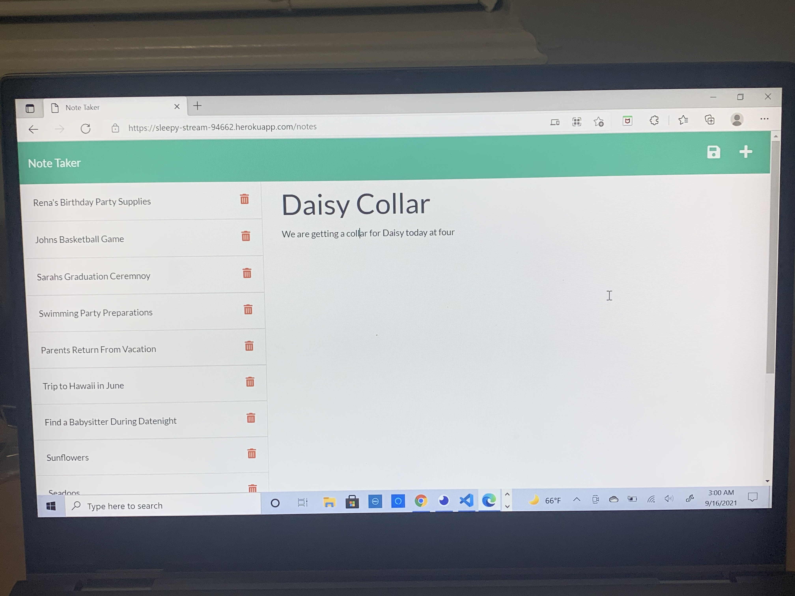

# Title
Note Taker and Organizer

# Application Descprition
In this challenge for module 11 I was tasked with creating the backend side of a front end application called note taker. Note taker is an application where people can write down events they have going on in their lives. This application attempts to solve the problem of people forgetting what events they need to attend by giving them a way to remeber what events they need to attend on a daily basis. By remebering what events are going on in their lives people can be organized and more productive with how they spend their time. 

# Application Overview
Backend:
We established a notes array in our db.json file to serve as the database for this application. The routes used to get the notes from the array or adding new notes to the array are all located in our server file. We connected the routes in the server file to the database by importing the db.json file into our server file. 

# Assignment Tasks
1. When the user logs into the application they are given a landing page where they can click a link to go the page with the notes
2. The notes page has all of the presaved notes on the lefthand column. The reight hand column has a space where the client can add notes to the note tracker and save those notes on the left hand column
3. After typing in the note and its text in the right hand column an icon appears in the top right corner that allows the user to save the notes to the notes in the left hand column
4. The user is able to click a plus icon to start writing down a new note and the text that is associated with it

# Tasks Achieved By:
I was able to achieve the tasks by reviewing the module and assimilating the concepts to what we were asked to do. I was also able to use past challenges for reference as well when it came to creating the readme file. Staying on course for today was also a big help in getting this assignment done

# Link to Deployed Applicaiton:
<a href="https://sleepy-stream-94662.herokuapp.com/notes">Link to Deployed Application</a>

# Screenshot for Deployed Application:

# Contributors
Made with Love By Josh Jackson